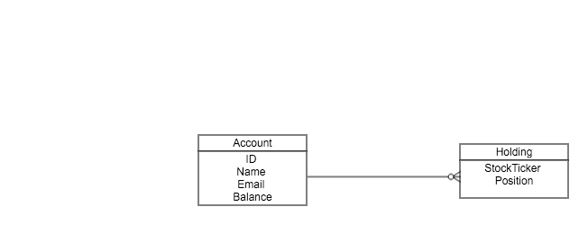
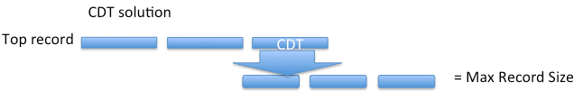
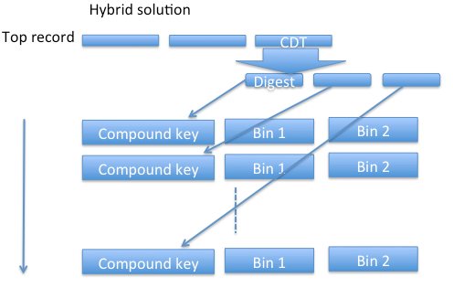

# LargeList

This is an implementation of a LargeList that uses standard records. It provides a one-to-many relationship. 

Consider the following scenario:

A customer holds an account with a strockbroking firm. The account can have zero or more holdings associated with it. An account has a zero-to-many relationship with holding, and reflects the account holders market position.


The individual elements of the the LargeList are stored as separate records using a compound key. Foe example, if the primary key of the account record is the account number `1985672`, the compound key of the element containing GOOG (an account position of Google stocks) would be `1985671::GOOG`.

In a normal LDT list, there is a control Bin that stores LDT meta data and each element is stored in a special sub-record. 


In a CDT list, the elements of the list are stored contiguously in the Bin and the size of the list is limited by the maximum size of the record. Max record size is 128k by default, but can be expanded to 1M)



The internal implementation of LargeList is responsible for creating a compound primary key for the element when it is added to the collection. It also adds the digest of the element's key to a standard CDT list in the main record. This list is used to maintain the collection.



## API
The API uses the same method signatures as the LDT LargeList allowing a drop in replacement. Some methods that are available in the LDT LargeList are not implemented and will throw an `NotImplementedException` if called. 

## Examples
Here are several examples using different data types as list elements
### Adding 100 integers to a list
```C#
	Key key = new Key (NS, SET, "100-list-test-key-int");
	var ll = new Aerospike.Helper.Collections.LargeList (client, null, key, "100-int");
	for (int x = 0; x < number; x++) {
		ll.Add(Value.Get(x));
	}		
```
1. A top record is specified using a `Key`
2. A `LargeList` is created using an `AerospikeClient`, an optional WritePolicy, the top record key and the Bin names for the collection
3. 100 integers are added to the `LargeList`

### Adding 100 strings to a list
```C#
	Key key = new Key (NS, SET, "100-list-test-key-string");
	var ll = new Aerospike.Helper.Collections.LargeList (client, null, key, "100-string");
	for (int x = 0; x < number; x++) {
		ll.Add(Value.Get("cats-dogs-"+x));
	}			
```
1. A top record is specified using a `Key`
2. A `LargeList` is created using an `AerospikeClient`, an optional WritePolicy, the top record key and the Bin names for the collection
3. 100 strings are added to the `LargeList`

###Get all the elements from a list of strings
```C#
	Key key = new Key (NS, SET, "100-list-test-key-string");
	var ll = new Aerospike.Helper.Collections.LargeList (client, null, key, "100-string");
	IList values = ll.Scan ();
```
1. A top record is specified using a `Key`
2. A `LargeList` is created using an `AerospikeClient`, an optional WritePolicy, the top 
3. call `Scan()` to return a List\<String\>

The `Scan()` method is implemented with a batch read to return all the elements.

### More complex example
In this example, a number of elements are created that represent stock trades. These are added to the LargeList and returned with the `Range()` method.

```C#
	Key key = new Key(NS, SET, "accountId");

	// Delete record if it already exists.
	client.Delete(null, key);	

	// Initialize large list operator.
	Aerospike.Helper.Collections.LargeList list = new Aerospike.Helper.Collections.LargeList(client, null, key, "trades");

	list.Size ();

	// Write trades
	Dictionary<string,Value> dict = new Dictionary<string,Value>();

	DateTime timestamp1 = new DateTime(2014, 6, 25, 12, 18, 43);
	dict["key"] = Value.Get(timestamp1.Ticks);
	dict["ticker"] = Value.Get("IBM");
	dict["qty"] = Value.Get(100);
	dict["price"] = Value.Get(BitConverter.GetBytes(181.82));
	list.Add(Value.Get(dict));

	DateTime timestamp2 = new DateTime(2014, 6, 26, 9, 33, 17);
	dict["key"] = Value.Get(timestamp2.Ticks);
	dict["ticker"] = Value.Get("GE");
	dict["qty"] = Value.Get(500);
	dict["price"] = Value.Get(BitConverter.GetBytes(26.36));
	list.Add(Value.Get(dict));

	DateTime timestamp3 = new DateTime(2014, 6, 27, 14, 40, 19);
	dict["key"] = Value.Get(timestamp3.Ticks);
	dict["ticker"] = Value.Get("AAPL");
	dict["qty"] = Value.Get(75);
	dict["price"] = Value.Get(BitConverter.GetBytes(91.85));
	list.Add(Value.Get(dict));

	// Verify list size
	int size = list.Size();

	Assert.AreEqual (size, 3);

	// Filter on range of timestamps
	DateTime begin = new DateTime(2014, 6, 26);
	DateTime end = new DateTime(2014, 6, 28);
	IList results = list.Range(Value.Get(begin.Ticks), Value.Get(end.Ticks));

	Assert.AreEqual (results.Count, 2);

	// Verify data.
	ValidateWithDistinctBins(results, 0, timestamp2, "GE", 500, 26.36);
	ValidateWithDistinctBins(results, 1, timestamp3, "AAPL", 75, 91.85);

	Console.WriteLine("Data matched.");

	Console.WriteLine("Run large list scan.");
	IList rows = list.Scan();
	foreach (IDictionary row in rows)
	{
		foreach (DictionaryEntry entry in row)
		{
			Console.WriteLine(entry.Key.ToString());
			Console.WriteLine(entry.Value.ToString());
		}
	}
	Console.WriteLine("Large list scan complete.");

```


